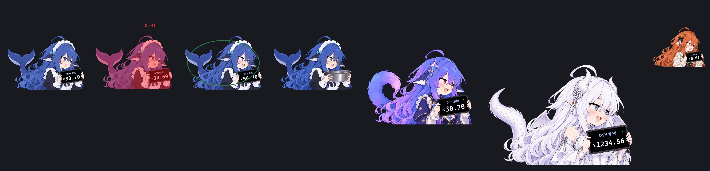

# VK-1 → DSH 插件

把 [VKmich16/VK-1](https://github.com/VKmich16/VK-1)（「DSH 余额桌宠」，原本是独立的
macOS Swift 应用 / Windows PowerShell 脚本）改造成 **DeepSeek Harness 的 web 插件**。

原版要自己读凭证文件、自己开一个无边框窗口、自己轮询余额。作为插件，这些职责回到 DSH 本身：
宿主半边用 DSH 自己的凭证服务与账号服务拿余额，浏览器半边只负责把那只鱼画在网页界面上。
结果是**一个 npm 包、零独立进程、跨平台**。



> 上图由 `.verify/render_preview.py` 用插件自己的几何常量离屏合成，展示的是角色画布本身
> （不含菜单弹层与余额胶囊）。单张图见 `docs/previews/`：`connected-medium`、`hit-medium`、
> `topup-medium`、`offline-medium`、`gemini-large`、`gpt-huge`、`claude-small`。

## 成果

| | |
| --- | --- |
| 插件包 | [`dsh-vk1-pet/`](dsh-vk1-pet) —— 可直接 `dsh plugin add` 的 bundle |
| 宿主半边 | 读凭证、轮询余额、暴露 `/dsh-vk1-pet/api/*` 与 `/dsh-vk1-pet/assets/*` |
| 浏览器半边 | 注册进 `shell.overlay` 的悬浮桌宠：四角色、拖拽吸附、扣费红闪/震动/原版音效、充值绿环、离线抱盆图、余额平板 |
| 验证 | 62 个自动化用例 + 独立 profile 端到端启动验证（不影响你正在用的 `dsh web`） |

详细说明见 [`dsh-vk1-pet/README.md`](dsh-vk1-pet/README.md)。

## 快速安装

```sh
cd /root/projs/ds_VK-1_plugin
dsh plugin --profile web add ./dsh-vk1-pet -w
dsh web            # 重启后生效
```

打开界面，桌宠出现在左下角，余额胶囊在它上方。右键桌宠或点胶囊打开菜单。

卸载：`dsh plugin --profile web remove dsh-vk1-pet`。

> 没有自动替你安装，也没有重启你正在使用的 `dsh web`：安装动作会改动 `web` profile，
> 重启会中断当前页面会话，这两件事留给你决定。

## 目录

```
.
├── dsh-vk1-pet/            插件包（交付物）
│   ├── host/               宿主半边，手写 ESM，无构建、无运行时依赖
│   ├── client/             浏览器半边（index.jsx → 构建为 client/client.js，产物已提交）
│   ├── assets/             5 张角色 PNG + hit.mp3，逐字节复制自上游
│   └── test/               62 个用例
├── docs/previews/          离线渲染的效果预览（由 .verify 生成）
├── scripts/publish.sh      建仓库 + 推送的一键脚本（见下）
├── .verify/                可复现的验证脚手架：独立 DSH_HOME、验证脚本、预览渲染器
└── repo/                   本地参考：上游 VK-1 的源码快照，**不入库**（见 .gitignore）
```

`repo/` 只是移植时用来比对素材的第三方 checkout（上游未附许可证），已写进 `.gitignore`。
插件真正分发的 5 张图与 `hit.mp3` 都在 `dsh-vk1-pet/assets/`，并逐文件记录了 SHA-256。

## 上传到 GitHub

本地仓库已经 `git init -b main` 并暂存好全部 49 个文件（约 12.7 MB），没有提交——
作者留给你自己的 `git config`。

```sh
# 1. 一次性设置提交身份（如果还没设过）
git config --global user.name  "你的名字"
git config --global user.email "你的邮箱"

# 2. 建仓库 + 提交 + 推送
scripts/publish.sh                        # 用 gh CLI 的登录态
GITHUB_TOKEN=ghp_xxx scripts/publish.sh   # 或用 fine-grained PAT
                                          # （Contents: read/write + Administration: write）
```

不想给任何令牌，就自己建好空仓库再推：

```sh
git commit -m "DSH 余额桌宠：把 VK-1 做成 DSH web 插件"
git remote add origin https://github.com/<你的用户名>/dsh-vk1-pet.git
git push -u origin main
```

脚本不会把令牌写进 `.git/config`，也不会替你写 `--author`；提交作者永远来自你的 git 配置。

## 设计要点

**为什么是网页桌宠，而不是一个工具插件。** VK-1 的全部价值在那只鱼：倾斜平板上滚动的余额、
掉钱时的一下红闪和震动。这些东西只有在界面上才有意义，所以插件形态选的是
`shell.overlay`——ui-layout 声明的「全框悬浮层」，它默认鼠标穿透，正是桌宠需要的位置。

**透明区域真的穿透。** 悬浮层默认穿透，但一个 1.4:1 的矩形命中区会挡住底下的输入框。
插件把每张角色图降采样成一张 alpha 掩码，指针移动时逐像素判定，只有压到不透明像素
才把 `pointer-events` 切成 `auto`。所以鱼的四周、尾巴的空隙都可以直接点到底下的界面。

**凭证不出宿主。** 浏览器只拿到一个只读投影（余额、状态、错误、来源标签）。
API Key 与平台令牌都留在 Node 进程里；每个 HTTP 路由先过
`ctx.connection.requestRejection()`，也就是 `/api` 用的同一套 Cookie 与 Host/Origin 栅栏。

**金额不用浮点。** 余额从十进制字符串精确解析到「分」，整数运算，最后一步按原版的
四舍五入规则定分。少一分钱就会触发一次震动和音效，浮点误差会被当成真实扣费。

**几何是移植的，不是估的。** 原版在 1536×1024 的原图上量了每块平板的三个角点。插件沿用
同一组数值，把它解成一个 CSS `matrix(...)`；测试逐点断言变换后的角点与测量值吻合，
`.verify/render_preview.py` 再用同一组矩阵离屏渲染出上面那张预览图。

## 验证

### 自动化用例（62 个）

```sh
cd dsh-vk1-pet && npm install && npm test
```

覆盖：十进制→分与舍入、`Retry-After`（秒数与 HTTP 日期）、钱包求和与货币校验、
`/user/balance` 各状态分支（含 401 / 429 / 重定向拒绝 / 超时 / 超大响应）、
动画状态机（0.2 秒步进、重复轮询不重放、大跳变直接对齐、演示不影响真实余额、
休眠不产生音效爆发）、平板仿射几何、主题令牌配对，以及两个渲染层级：

- **字符串渲染**：构建产物能否通过 `window.__ModuleLoader__` 注册，`apply` 是否只占一个
  `shell.overlay` 席位，四个角色能否无异常渲染。
- **真实 DOM（jsdom）**：把同一个构建产物挂进 DOM，用打桩的 `fetch` 依次喂
  「连接中 → 已连接 → 连接失败 → 未配置」四种宿主状态，断言抱盆图与平板相互切换、
  三个客串角色不受影响；再真的点开菜单触发一次扣费，检查金额飘字是否按状态显示。

### 端到端启动验证

`dsh web` 被完整启动了两次，用的都是工作区内的独立 `DSH_HOME`，**没有触碰 `~/.dsh`**：

```sh
.verify/run.sh            # 用 --patch 绝对路径挂载插件，端口 3099
.verify/run-installed.sh  # 用 dsh plugin add 安装后的 profile，端口 3098
```

验证内容与实际结果：

| 检查 | 结果 |
| --- | --- |
| 插件进入 `window.__DSH_BOOT__` 客户端图 | `{"id":"dsh-vk1-pet","url":"/plugins/??dsh-vk1-pet/client.js&rev=…"}` |
| `/dsh-vk1-pet/api/state` | `200`，`status: ready`，`fen: 3070`，`display: "30.70"`，`source: "API Key"` |
| 与 `api.deepseek.com/user/balance` 直连对比 | 完全一致（`total_balance: "31.00"` 时刻读到的就是 `3100` 分） |
| 5 张角色图 + `hit.mp3` | `200`，`image/png` / `audio/mpeg`，字节数与源文件一致 |
| 路径穿越 `assets/../package.json` | `404` |
| 无 Cookie 访问 api / assets | `401`（走 DSH 自己的浏览器鉴权） |
| `POST /api/refresh` | `200`，revision 递增 |
| `POST /api/settings`（合法 / 非法间隔、非法来源） | `200` / `400` / `400`，并落盘 `$DSH_HOME/dsh-vk1-pet/config.json` |
| `GET` 打到 POST 路由 | `405` |
| `dsh plugin --profile vk1bundle add ./dsh-vk1-pet` | 自动写入 `dsh.profile.bundles`，`--dump-config` 出现 `# == dsh-vk1-pet` 层 |

本环境没有可用的浏览器/显示器（也无 headless Chromium），所以**没有做真实像素截图**：
界面部分用「构建产物在 React 下真实渲染 + 离屏按同一组矩阵合成预览图」来验证，
实际观感请你在自己的浏览器里确认。

重新生成预览图：

```sh
node .verify/preview-geometry.mjs > .verify/geometry.json
PYTHONPATH=.verify/pylibs python3.12 .verify/render_preview.py
```

### 还没验证的

- Windows / Linux 上 `dsh web` 的实际观感（本机只有 Linux，且无浏览器）。
- DSH 平台账号模式（`ctx.deepseekAccount`）的实机余额：本机只有 API Key 凭证，
  账号分支只做了代码路径与类型层面的对齐，没有真实登录态可测。
- 长时间运行下的 429 退避与多标签页轮询压力。

## 来源与许可

插件代码 MIT，见 [`dsh-vk1-pet/LICENSE`](dsh-vk1-pet/LICENSE)。角色图片与 `hit.mp3`
来自上游 VK-1（上游未附许可证），本仓库只做逐字节复制并保留来源说明与 SHA-256，
不额外授权，详见 [`dsh-vk1-pet/assets/README.md`](dsh-vk1-pet/assets/README.md)。
